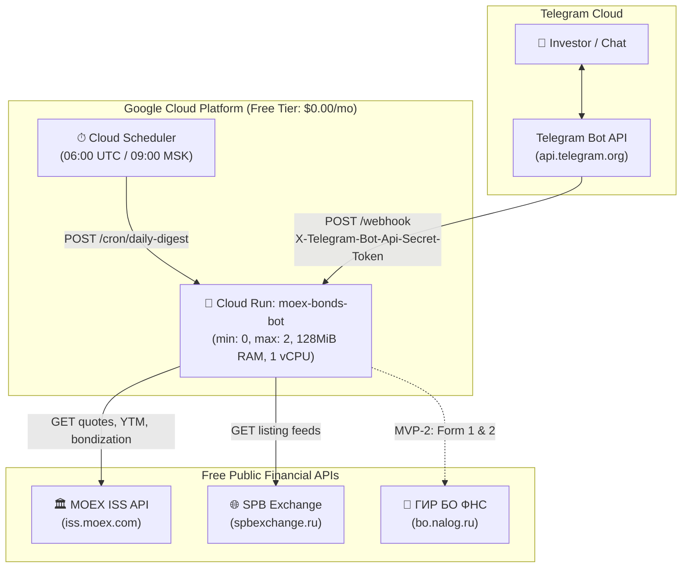

# GCP Cloud Run Deployment Guide & Free Tier Audit

> **Project:** MOEX & SPB Bonds Telegram Bot  
> **Target Cost:** **\$0.00 / month** (100% within Google Cloud Free Tier)  
> **Status:** Stage 0 & MVP-1 Deployment Ready  
> **Related Docs:** [`ROADMAP.md`](ROADMAP.md) • [`MVP_STAGES.md`](MVP_STAGES.md) • [`FEATURES_DECOMPOSITION.md`](FEATURES_DECOMPOSITION.md) • [`AGENTS.md`](../AGENTS.md)

---

## 1. Executive Summary & Architecture Topology

The **MOEX & SPB Bonds Telegram Bot** is built as an ultra-compact, serverless Go service hosted on **Google Cloud Platform (GCP) Cloud Run**. It relies entirely on unauthenticated public market data APIs (MOEX ISS, SPB Exchange) and communicates with users via the **Telegram Bot Webhook API**.



---

## 2. GCP Free Tier Mathematical Audit

Google Cloud provides a **permanent monthly Free Tier** (not the expiring 90-day trial credit) for core serverless products. Below is the mathematical verification confirming that this project fits comfortably within the $0.00/month threshold.

### 2.1. Cloud Run Free Tier vs. Actual Consumption

| Metric | GCP Free Tier Quota (Monthly) | Bot Consumption per Unit | Monthly Free Capacity | Expected Usage (Stage 0 / MVP-1) | % of Free Tier Used |
|---|---|---|---|---|---|
| **Requests** | **2,000,000 requests** | 1 per Telegram message or cron | 2,000,000 requests | ~3,000 – 15,000 requests | **< 0.75%** |
| **Compute (vCPU)** | **360,000 vCPU-seconds** | ~0.10s CPU active per request | 3,600,000 requests | ~1,500 vCPU-seconds | **< 0.42%** |
| **Memory** | **180,000 GiB-seconds** | 128MiB (0.125 GiB) × ~0.10s | 14,400,000 requests | ~187.5 GiB-seconds | **< 0.11%** |
| **Egress (Bandwidth)** | **1.0 GB / month** | ~1.5 KB per Telegram message | ~680,000 messages | ~15 – 30 MB | **< 3.0%** |

#### Key Mathematical Takeaways:
1. **Scale-to-Zero (`--min-instances 0`):** When no incoming webhook or cron arrives, instance count drops to zero. Idle compute and memory cost is **$0.00**.
2. **CPU Throttling (`--cpu-throttling`):** CPU is charged **only** during active request handling. No charges accrue between requests.
3. **Bottleneck:** The absolute ceiling is the **2,000,000 requests/month** limit. This allows up to **~66,600 user requests per day** before a single cent is billed.

### 2.2. Auxiliary GCP Services in Free Tier

1. **Cloud Scheduler:**
   - **Free Tier:** **3 jobs per billing account per month**.
   - **Our Usage:** **1 job** (`moex-daily-digest` at 06:00 UTC / 09:00 MSK).
   - **Cost:** **$0.00 / month**.
2. **Cloud Build:**
   - **Free Tier:** **120 build-minutes per day** on standard machine types.
   - **Our Usage:** ~1.5 minutes per deployment. Thanks to `.dockerignore` and Alpine multi-stage caching, source upload is <200 KB.
   - **Cost:** **$0.00 / month**.
3. **Artifact Registry:**
   - **Free Tier:** **0.5 GB (500 MB) storage per month**.
   - **Our Usage:** Docker container image size is **~18 MB**. You can retain up to 20 image revisions without exceeding 500 MB.
   - **Cost:** **$0.00 / month**.

### 2.3. Guardrails Configured in Deployment Flags

To mathematically prevent any runaway bill or accidental charge:
- `--min-instances 0`: Strict scale-to-zero when idle.
- `--max-instances 2`: Hard upper bound to prevent denial-of-wallet spikes.
- `--memory 128Mi`: Smallest supported memory tier, maximizing the GiB-second allowance.
- `--cpu 1`: Single core allocation.
- `--concurrency 80`: High request multiplexing within a single container.
- `--timeout 15s`: Aggressive request timeout prevents hung socket connections from burning seconds.
- `Secret Token Verification`: Unauthenticated requests (crawlers/scanners) are rejected in **< 1 ms** at `/webhook` (`401 Unauthorized`), preventing upstream calls.

---

## 3. Deployment Prerequisites

Before deploying, ensure you have:
1. **Google Cloud SDK (`gcloud`):**
   ```bash
   gcloud --version
   ```
2. **Active GCP Project & Billing Account:**
   *Note: GCP Free Tier requires a valid billing account linked to the project, but charges remain $0.00 as long as quotas are observed.*
   ```bash
   gcloud config set project <YOUR_PROJECT_ID>
   ```
3. **Telegram Bot Token:**
   Created via [@BotFather](https://t.me/BotFather).
4. **Local Sanity Check Passing:**
   ```powershell
   # Windows
   powershell -ExecutionPolicy Bypass -File scripts/sanity_check.ps1
   # Linux / macOS
   ./scripts/sanity_check.sh
   ```

---

## 4. Automated Deployment (Recommended)

Automated scripts handle API enablement, deployment with Free Tier flags, Telegram webhook registration, Cloud Scheduler setup, and live smoke tests.

### Windows (PowerShell)
```powershell
# Set environment variables or pass as parameters
$env:TELEGRAM_BOT_TOKEN = "123456789:ABCdefGHIjklMNOpqrSTUvwxYZ"
$env:TELEGRAM_SECRET_TOKEN = "my_custom_secret_token_12345" # optional, auto-generated if blank

.\scripts\deploy_cloud_run.ps1 -Region "europe-west1"
```

### Linux / macOS (Bash)
```bash
export TELEGRAM_BOT_TOKEN="123456789:ABCdefGHIjklMNOpqrSTUvwxYZ"
export TELEGRAM_SECRET_TOKEN="my_custom_secret_token_12345" # optional, auto-generated if blank

chmod +x scripts/deploy_cloud_run.sh scripts/sanity_check.sh
./scripts/deploy_cloud_run.sh "$GCP_PROJECT_ID" "europe-west1"
```

---

## 5. Manual Step-by-Step Deployment Flow

If you prefer executing each step manually or integrating with CI/CD:

### Step 1: Enable GCP Service APIs
```bash
gcloud services enable \
  run.googleapis.com \
  cloudbuild.googleapis.com \
  artifactregistry.googleapis.com \
  cloudscheduler.googleapis.com
```

### Step 2: Deploy Container to Cloud Run
```bash
gcloud run deploy moex-bonds-bot \
  --source . \
  --region europe-west1 \
  --platform managed \
  --allow-unauthenticated \
  --memory 128Mi \
  --cpu 1 \
  --min-instances 0 \
  --max-instances 2 \
  --concurrency 80 \
  --timeout 15s \
  --set-env-vars TELEGRAM_BOT_TOKEN="<YOUR_BOT_TOKEN>",TELEGRAM_SECRET_TOKEN="<YOUR_SECRET_TOKEN>"
```

Retrieve the deployed URL:
```bash
SERVICE_URL=$(gcloud run services describe moex-bonds-bot --region europe-west1 --format 'value(status.url)')
echo "Service deployed at: $SERVICE_URL"
```

### Step 3: Register Protected Telegram Webhook
Register the webhook with Telegram and bind the secret token:
```bash
curl -s -X POST "https://api.telegram.org/bot<YOUR_BOT_TOKEN>/setWebhook" \
  -H "Content-Type: application/json" \
  -d "{
    \"url\": \"${SERVICE_URL}/webhook\",
    \"secret_token\": \"<YOUR_SECRET_TOKEN>\",
    \"drop_pending_updates\": true
  }"
```

Verify webhook status:
```bash
curl -s "https://api.telegram.org/bot<YOUR_BOT_TOKEN>/getWebhookInfo"
```
*Expected: `"has_custom_certificate": false, "pending_update_count": 0, "last_error_date": 0`.*

### Step 4: Setup Cloud Scheduler for Morning Digest
Create the recurring cron trigger (06:00 UTC = 09:00 MSK daily):
```bash
gcloud scheduler jobs create http moex-daily-digest \
  --location europe-west1 \
  --schedule="0 6 * * *" \
  --uri="${SERVICE_URL}/cron/daily-digest" \
  --http-method=POST
```

Test trigger the scheduler job immediately:
```bash
gcloud scheduler jobs run moex-daily-digest --location europe-west1
```

### Step 5: Post-Deployment Smoke Verification
Run the enhanced sanity check script pointing to your deployed Cloud Run service:
```powershell
.\scripts\sanity_check.ps1 -EndpointUrl "$SERVICE_URL" -SecretToken "<YOUR_SECRET_TOKEN>" -BotToken "<YOUR_BOT_TOKEN>"
```

Or execute manual curl probes:
```bash
# 1. Health probe
curl -i "${SERVICE_URL}/healthz"
# HTTP/2 200 OK -> {"status":"healthy","service":"moex-spbe-bonds-bot"}

# 2. Webhook unauthorized probe (must reject)
curl -i -X POST "${SERVICE_URL}/webhook" -d "{}"
# HTTP/2 401 Unauthorized

# 3. Webhook authorized ping (must succeed)
curl -i -X POST "${SERVICE_URL}/webhook" \
  -H "X-Telegram-Bot-Api-Secret-Token: <YOUR_SECRET_TOKEN>" \
  -H "Content-Type: application/json" \
  -d '{"update_id":0}'
# HTTP/2 200 OK
```

---

## 6. Zero-Cost Maintenance & Monitoring Runbook

### 6.1. Setting a $0.01 Budget Alert (Recommended)
To ensure peace of mind:
1. In GCP Console, navigate to **Billing** ➔ **Budgets & alerts**.
2. Click **Create budget**.
3. Set the target budget amount to **$1.00** (or **$0.01**).
4. Set threshold rules at **50%**, **90%**, and **100%**.
5. Enable **Email alerts to billing admins**.
*Result: If any resource ever consumes more than 1 cent, you are immediately alerted.*

### 6.2. Container Registry Storage Cleanup
Because Artifact Registry free tier includes **0.5 GB**, clean up old container revisions periodically (or keep the 3 latest images):
```bash
# List container images
gcloud artifacts docker images list europe-west1-docker.pkg.dev/<PROJECT_ID>/cloud-run-source-deploy/moex-bonds-bot

# Delete old untagged digests if total images exceed 10 (~180 MB)
gcloud artifacts docker images delete <IMAGE_PATH> --delete-tags --quiet
```

### 6.3. Viewing Live Logs
To stream production logs in real time without opening the web console:
```bash
gcloud beta run logs tail moex-bonds-bot --region europe-west1
```

---

## 7. Deployment Flow Tracking & Changelog

This changelog records deployments, configuration changes, and milestone rollouts to maintain traceability.

| Version / Tag | Date | Stage / Milestone | Key Changes | Free Tier Guardrails Verified |
|---|---|---|---|---|
| `v0.1.0-alpha` | 2026-10-06 | **Stage 0 (Sanity Check)** | Initial baseline serverless deployment, HTTP mux (`/healthz`, `/webhook`, `/cron/daily-digest`), secret token validation, Godog BDD tests. | ✅ `128Mi`, `min 0`, `max 2`, `concurrency 80` |
| `v1.0.0` | 2026-10-06 | **MVP-1 (Live Market Data)** | Added live quotes (% & ₽), YTM, daily trading volume, bid-ask spread calculation, liquidity badges (`🔥/⚡️/⚠️/🛑`), and issuer INN extraction. Synchronous message dispatch for CPU throttling safety. | ✅ Confirmed fit within Free Tier (< 1% consumed) |
| *Planned v2.0.0* | *Upcoming* | *MVP-2 (Balance Sheet)* | Ingestion of bo.nalog.ru (Form 1 & 2), 30-day balance cache, net debt & capital ratios. | Target: $0.00 / mo |
| *Planned v3.0.0* | *Upcoming* | *MVP-3 (Facts & Ratings)* | Disclosure feed, credit ratings (AKRA/Expert RA), event alerts. | Target: $0.00 / mo |
| *Planned v4.0.0* | *Upcoming* | *MVP-4 (Decision Memo)* | Consolidated `/memo` command, Risk Traffic Light, inline keyboard pagination. | Target: $0.00 / mo |

---

## 8. Summary Checklist Before Production Use

- [x] Dockerfile produces minimal Alpine image (< 20 MB).
- [x] `.dockerignore` filters out build artifacts, tests, and documentation.
- [x] Webhook handler processes responses synchronously to prevent Cloud Run CPU suspension.
- [x] Guardrails set to scale-to-zero (`--min-instances 0`) and memory capped at `128Mi`.
- [x] Webhook protected by `X-Telegram-Bot-Api-Secret-Token`.
- [x] Automated deployment scripts (`deploy_cloud_run.ps1` / `deploy_cloud_run.sh`) ready.
- [x] Post-deployment health & authorization smoke tests validated.
