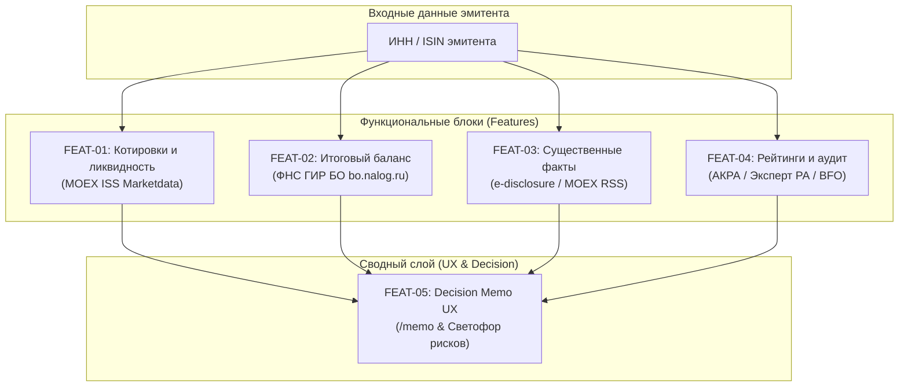

# Master Features & Sub-Tasks Decomposition

> **Project:** MOEX & SPB Bonds Telegram Bot  
> **Initiative:** Decision Support & Consolidated Issuer Memo ("Единое окно инвестора")  
> **Reference Document:** [`docs/ROADMAP.md`](ROADMAP.md)  
> **Status:** Specification Complete • Ready for Implementation  

---

## 1. Обзор архитектурной декомпозиции

На основе анализа пользовательского отзыва разработана модульная система из **5 функциональных фич (Features)**, разбитых на **30 атомарных подзадач (Sub-tasks)**.

Каждая подзадача полностью специфицирована: указаны входные/выходные данные, изменяемые пакеты, алгоритмы и критерии готовности (Definition of Done).

---

## 2. Матрица фич и спецификаций

| Feature ID | Название | Назначение | Документ спецификации | Задач | Приоритет |
|---|---|---|---|---|---|
| **STAGE-00** | **Sanity Check & Infrastructure** | Развертывание бота, проверка API, Cloud Run, секретов и вебхука | [`STAGE-00-sanity-check.md`](features/STAGE-00-sanity-check.md) | 6 | P0 (Prerequisite) |
| **FEAT-01** | **Market Data & Liquidity** | Текущие котировки, YTM, дневной оборот, спред и скоринг ликвидности | [`FEAT-01-market-data-liquidity.md`](features/FEAT-01-market-data-liquidity.md) | 6 | P0 (Must) |
| **FEAT-02** | **Issuer Balance Sheet** | Итоговый баланс (Активы, Капитал, Чистый долг, Выручка, Прибыль) из ФНС | [`FEAT-02-balance-sheet.md`](features/FEAT-02-balance-sheet.md) | 7 | P0 (Must) |
| **FEAT-03** | **Material Facts & Events** | Лента существенных фактов: дефолты, оферты, решения СД/ВОСА, суды | [`FEAT-03-material-facts.md`](features/FEAT-03-material-facts.md) | 6 | P1 (Should) |
| **FEAT-04** | **Credit Ratings & Audit** | Кредитные рейтинги (АКРА, Эксперт РА), надежность аудитора и тип заключения | [`FEAT-04-credit-ratings-audit.md`](features/FEAT-04-credit-ratings-audit.md) | 5 | P1 (Should) |
| **FEAT-05** | **Decision Memo UX** | Команда `/memo`, «Светофор рисков» (🟢/🟡/🔴), Telegram Inline-вкладки | [`FEAT-05-decision-memo-ux.md`](features/FEAT-05-decision-memo-ux.md) | 6 | P0 (Must) |

---

## 3. Сводный список подзадач (Task Registry)

### STAGE-00: Sanity Check & Инфраструктура
- [x] `TASK-00-01`: Проверка локальной компиляции бинарника и сборки Docker-образа (Alpine <20MB, `.dockerignore`)
- [x] `TASK-00-02`: Зондирование сетевой доступности внешних API (MOEX ISS, SPBE, bo.nalog.ru)
- [x] `TASK-00-03`: Развертывание в GCP Cloud Run: аудит Free Tier и скрипты автоматизации (`deploy_cloud_run.ps1` / `.sh`)
- [x] `TASK-00-04`: Регистрация и проверка безопасности вебхука Telegram (`secret_token` и синхронная обработка для Cloud Run)
- [x] `TASK-00-05`: Автоматизированный скрипт смоук-тестирования системы (`scripts/sanity_check.ps1` / `.sh`)
- [x] `TASK-00-06`: Проверка Cloud Scheduler для утреннего дайджеста купонов (настройка в скриптах деплоя)

### FEAT-01: Рыночные данные и ликвидность
- [x] `TASK-01-01`: Расширение доменной модели `MarketData` и интерфейса `MarketDataProvider`
- [x] `TASK-01-02`: Клиент MOEX ISS: выбор режима торгов (`TQCB`/`TQOB`) и извлечение котировок
- [x] `TASK-01-03`: Расчет спреда и алгоритм скоринга ликвидности (Высокая / Средняя / Низкая / Неликвид)
- [x] `TASK-01-04`: Кэширующий слой `MarketDataCache` (TTL 2 минуты в торговые часы)
- [x] `TASK-01-05`: Обновление Telegram-форматтера `/bond` для отображения рыночного блока
- [x] `TASK-01-06`: BDD-сценарии и шаги тестирования рыночных данных

### FEAT-02: Итоговый баланс эмитента
- [ ] `TASK-02-01`: Доменная модель финансовой отчетности `IssuerBalance`
- [x] `TASK-02-02`: Извлечение и нормализация ИНН эмитента из метаданных MOEX ISS
- [ ] `TASK-02-03`: Реализация клиента ГИР БО (ФНС bo.nalog.ru) по ИНН эмитента
- [ ] `TASK-02-04`: Движок расчета ключевых мультипликаторов (Чистый долг, Долг/Капитал)
- [ ] `TASK-02-05`: Хранилище и кэширование баланса с TTL 30 дней
- [ ] `TASK-02-06`: Telegram-форматтер компактного баланса и команда `/balance <ISIN>`
- [ ] `TASK-02-07`: BDD-сценарии и шаги тестирования бухотчетности

### FEAT-03: Существенные факты и события
- [ ] `TASK-03-01`: Доменная модель `MaterialFact` с категоризацией и уровнями критичности
- [ ] `TASK-03-02`: Парсер ленты раскрытия информации e-disclosure.ru и MOEX News
- [ ] `TASK-03-03`: Классификатор критических событий (Оферта, Дефолт, Созыв собрания, Суд)
- [ ] `TASK-03-04`: Сервис отображения свежих фактов и команда `/facts <ISIN>`
- [ ] `TASK-03-05`: Интеграция триггерных алертов в подсистему подписок (`/sub add`)
- [ ] `TASK-03-06`: BDD-сценарии и шаги тестирования мониторинга фактов

### FEAT-04: Кредитные рейтинги и аудиторское заключение
- [ ] `TASK-04-01`: Доменные структуры `CreditRating` и `AuditConclusion`
- [ ] `TASK-04-02`: Провайдер кредитных рейтингов (листинг MOEX + агрегатор агентств АКРА/RAEX)
- [ ] `TASK-04-03`: Парсинг аудитора и модификации аудиторского заключения из отчетов ФНС
- [ ] `TASK-04-04`: Нормализация рейтинговых шкал к единой шкале надежности
- [ ] `TASK-04-05`: BDD-сценарии и шаги тестирования кредитных рейтингов

### FEAT-05: Интерактивный Decision Memo UX
- [ ] `TASK-05-01`: Композитный сервис принятия решений `DecisionMemoService`
- [ ] `TASK-05-02`: Алгоритм экспресс-оценки «Светофор рисков» (Traffic Light Risk Score)
- [ ] `TASK-05-03`: Инлайн-клавиатура (Inline Keyboard) и менеджер навигации по вкладкам
- [ ] `TASK-05-04`: Обработчик Callback Query (`editMessageText`) без спама в чат
- [ ] `TASK-05-05`: Команда `/memo <ISIN>` и связка с `/bond` (кнопка детального анализа)
- [ ] `TASK-05-06`: Сквозные BDD-тесты пользовательского сценария принятия инвестиционного решения

---

## 4. Порядок и очередность реализации

1. **Итерация 1 (Рыночный блок):** `FEAT-01` (быстрый результат на базе существующего MOEX-клиента).
2. **Итерация 2 (Фундаментал):** `FEAT-02` (интеграция с официальным бесплатным API ФНС).
3. **Итерация 3 (События и риск-сигналы):** `FEAT-03` + `FEAT-04` (раскрытие фактов и кредитный профиль).
4. **Итерация 4 (Единое окно):** `FEAT-05` (сборка всех компонентов в интуитивный интерактивный интерфейс).
