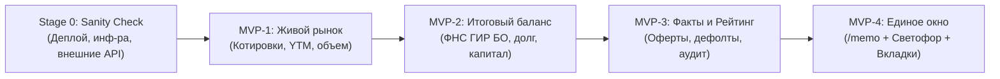

# MVP Stages Decomposition: Decision Support System

> **Project:** MOEX & SPB Bonds Telegram Bot  
> **Initiative:** Decision Support & Consolidated Issuer Memo ("Единое окно инвестора")  
> **Reference Documents:** [`docs/ROADMAP.md`](ROADMAP.md) • [`docs/FEATURES_DECOMPOSITION.md`](FEATURES_DECOMPOSITION.md)  
> **Status:** Approved for Phased Delivery  

---

## 1. Концепция поэтапного выкатывания (Staging Strategy)

Вместо масштабного монолитного релиза, требующего одновременной реализации 30 задач, проект разбивается на **4 последовательных MVP-этапа**.

Каждый этап:
1. Решает **конкретную изолированную проблему инвестора** из исходного фидбека.
2. Является **полноценно поставляемым инкрементом (Shippable Increment)**: содержит код, кэш, форматтер, Telegram-команду и BDD-тесты.
3. Сохраняет архитектурный принцип: **$0.00 / месяц** затрат на инфраструктуру (GCP Cloud Run Free Tier + бесплатные официальные публичные API).



---

## 2. Сводная матрица MVP-этапов

| Этап | Кодовое название | Фокус и ключевая ценность | Входящие задачи | Поставляемый результат |
|---|---|---|---|---|
| **Stage 0** | **Sanity Check & Инфраструктура** | Развертывание бота, проверка всех внешних API, Cloud Run, секретов и вебхука | `TASK-00-01` .. `TASK-00-06` | Работающий в облаке бот, проверенные каналы данных, скрипт смоук-тестов |
| **MVP-1** | **Живой рынок и ликвидность** | Актуальная цена (% и ₽), доходность YTM, оборот и индикатор спреда | `TASK-01-01` .. `TASK-01-06`<br/>+ `TASK-02-02` (ИНН) | Команда `/bond <ISIN>` дополнена блоком реальных биржевых торгов (✅ Завершено) |
| **MVP-2** | **Финансовая устойчивость** | Ключевая выжимка баланса (Активы, Капитал, Чистый долг, Выручка) | `TASK-02-01` .. `TASK-02-07` | Новая команда `/balance <ISIN>` + экспресс-оценка нагрузки |
| **MVP-3** | **События и кредитное качество** | Свежие факты (оферты, дефолты, суды) + Кредитный рейтинг и аудит | `TASK-03-01` .. `TASK-03-06`<br/>+ `TASK-04-01` .. `TASK-04-05` | Команда `/facts <ISIN>`, блок рейтинга и триггерные push-алерты |
| **MVP-4** | **Единое окно принятия решений** | Полная консолидация: `/memo`, «Светофор рисков» (🟢/🟡/🔴), вкладки | `TASK-05-01` .. `TASK-05-06` | Интерактивное «Единое окно» с переключением разделов без флуда |

---

## 3. Детальная спецификация каждого MVP-этапа

---

### Этап 0 (Stage 0): «Sanity Check & Инфраструктура»
> **Срок реализации:** 0.5–1 день  
> **Приоритет:** P0 (Обязательный фундамент перед новым кодом)  
> **Цель:** *«Убедиться, что текущая кодовая база собирается в Docker, деплоится на GCP Cloud Run, вебхук и секреты Telegram работают, а живые внешние API (MOEX ISS, SPBE) доступны без блокировок»*.

#### 1. Scope (Что входит):
- `TASK-00-01`: Сборка бинарника и Docker-образа (`Dockerfile` multi-stage build, размер < 20 МБ).
- `TASK-00-02`: Pre-flight проверка сетевой доступности внешних API (MOEX ISS, SPB Exchange, bo.nalog.ru) без авторизации.
- `TASK-00-03`: Развертывание в GCP Cloud Run (`gcloud run deploy`) с переменными окружения (`TELEGRAM_BOT_TOKEN`, `TELEGRAM_SECRET_TOKEN`).
- `TASK-00-04`: Регистрация и верификация вебхука Telegram (`setWebhook` с секретным токеном в заголовке `X-Telegram-Bot-Api-Secret-Token`).
- `TASK-00-05`: Автоматизированный скрипт смоук-тестирования (`scripts/sanity_check.ps1` / `scripts/sanity_check.sh`), проверяющий `/healthz`, `/webhook` и команду `/bond SU26238RMFS4`.
- `TASK-00-06`: Проверка работоспособности Cloud Scheduler для ежедневного крона (`/cron/daily-digest`).

#### 2. Критерии приемки (Definition of Done):
1. Контейнер успешно задеплоен на Cloud Run и возвращает `200 OK` на `/healthz`.
2. Бот отвечает в Telegram на команду `/bond SU26238RMFS4` реальными данными с MOEX ISS.
3. Неавторизованные запросы к `/webhook` отклоняются со статусом `401 Unauthorized` / `403 Forbidden`.
4. Скрипт смоук-чека завершается с кодом 0 (All systems operational).

---

### Этап 1 (MVP-1): «Живой рынок и ликвидность» — ✅ ЗАВЕРШЕНО
> **Срок реализации:** 1–2 дня  
> **Приоритет:** P0 (Quick Win)  
> **Статус:** 100% выполнено, покрыто BDD и юнит-тестами, проверено на живом MOEX ISS API  
> **Цель инвестора:** *«Узнать, сколько реально стоит бумага прямо сейчас, какая доходность и смогу ли я ее легко продать/купить в стакане брокера»*.

#### 1. Scope (Что входит):
- `TASK-01-01`: Доменная модель `MarketData` в `internal/domain/market_data.go`.
- `TASK-01-02`: Клиент MOEX ISS: запрос эндпоинта `marketdata` для режимов `TQCB` (корпораты) и `TQOB` (ОФЗ).
- `TASK-01-03`: Расчет спреда `SpreadPct` и присвоение уровня ликвидности:
  - 🔥 **Высокая:** оборот > 10 млн ₽/день, спред < 0.5%.
  - ⚡️ **Средняя:** оборот 1–10 млн ₽/день, спред < 1.5%.
  - ⚠️ **Низкая:** оборот < 1 млн ₽/день или спред > 1.5%.
  - 🛑 **Неликвид:** 0 сделок за день.
- `TASK-01-04`: In-memory кэш с окном 120 сек (в торговые часы) и 60 мин (ночью/выходные).
- `TASK-01-05`: Обновление Telegram-форматтера `FormatBondPassport`.
- `TASK-02-02` *(подготовка к MVP-2)*: Извлечение `emitent_inn` из ответа MOEX ISS.
- `TASK-01-06`: BDD-тесты проверки рыночных цен и объемов в Godog.

#### 2. Out of Scope (Осознанно отложено):
- Балансовые показатели, парсинг сайтов раскрытия, инлайн-кнопки.

#### 3. UX в Telegram (Карточка `/bond SU26238RMFS4`):
```text
🏛 ОФЗ 26238 (SU26238RMFS4)
Тикер: SU26238RMFS4 • Биржа: MOEX
Эмитент: Минфин РФ (ИНН: 7710168360)
Номинал: 1 000 RUB • Погашение: 15.10.2041
Купон: 7.10% (2 вып./год)

📈 Торги и ликвидность:
• Цена: 54.20% (542.00 ₽) • НКД: 33.80 ₽
• Доходность (YTM): 17.85% • Дюрация: 2450 дн. (~6.7 лет)
• Оборот сегодня: 142.5 млн ₽ (382 сделки)
• Ликвидность: 🔥 Высокая (спред: 0.08%)

📅 Ближайшие выплаты:
• 15.04.2027: Купон 35.40 RUB
```

#### 4. Критерии приемки (Definition of Done):
1. Запрос `/bond` выводит цену, YTM, объем торгов за текущий торговый день.
2. В неторговые дни/часы выводится цена предыдущего закрытия (`PREVLEGALCLOSEPRICE`).
3. Запуск `go test ./tests/bdd` проходит на 100%.

---

### Этап 2 (MVP-2): «Финансовая устойчивость (Итоговый баланс)»
> **Срок реализации:** 2–3 дня  
> **Приоритет:** P0  
> **Цель инвестора:** *«Не читать 100 страниц МСФО, а в 1 клик увидеть чистый долг, капитал, прибыль и понять, справится ли эмитент с долгами»*.

#### 1. Scope (Что входит):
- `TASK-02-01`: Доменная модель `IssuerBalance` в `internal/domain/balance.go`.
- `TASK-02-03`: HTTP-клиент к открытому API **ГИР БО (ФНС России bo.nalog.ru)**:
  - Парсинг баланса (Форма 1) и отчета о финрезультатах (Форма 2).
  - Сбор строк: Активы (1600), Капитал (1300), Долгосрочные обязательства (1410), Краткосрочные кредиты (1510), ДС (1250), Выручка (2110), Чистая прибыль (2400).
- `TASK-02-04`: Расчет финансовой нагрузки:
  - `NetDebt = (1410 + 1510) - 1250`
  - `DebtToEquity = NetDebt / 1300`
  - Экспресс-метка: 🟢 Низкая (< 1.0) / 🟡 Умеренная (1.0–2.5) / 🔴 Высокая (> 2.5).
- `TASK-02-05`: Кэширование отчетности на 30 дней.
- `TASK-02-06`: Новая команда `/balance <ISIN>` и компактный форматтер.
- `TASK-02-07`: BDD-тесты проверки расчета баланса.

#### 2. Out of Scope:
- Парсинг судебных исков, кредитные рейтинги агентств.

#### 3. UX в Telegram (Команда `/balance RU000A107456`):
```text
📑 Финансовый баланс: ПАО «ЕвроТранс»
ИНН: 7708304940 • Отчетность: 2025 г. (ГИР БО / ФНС)

💰 Активы и Капитал:
• Активы (баланс): 114.2 млрд ₽
• Собственный капитал: 38.5 млрд ₽

💳 Долговая нагрузка:
• Совокупный долг: 58.1 млрд ₽
• Денежные средства: 8.8 млрд ₽
• Чистый долг: 49.3 млрд ₽
• Долг / Капитал: 1.28 (🟡 Умеренная нагрузка)

📊 Результаты года:
• Выручка: 126.4 млрд ₽
• Чистая прибыль: 4.8 млрд ₽
```

#### 4. Критерии приемки (Definition of Done):
1. Команда `/balance <ISIN>` или `/balance <ИНН>` отдает баланс за 1 секунду.
2. При повторном запросе ответ возвращается из кэша < 10 мс.
3. Корректная обработка ОФЗ/Минфина (пояснение о суверенном статусе без стандартной формы РСБУ).

---

### Этап 3 (MVP-3): «События, Кредитный рейтинг и Аудит»
> **Срок реализации:** 3–4 дня  
> **Приоритет:** P1  
> **Цель инвестора:** *«Узнать кредитный рейтинг от АКРА/Эксперт РА, проверить, чистое ли аудиторское заключение, и вовремя узнать об оферте или дефолте»*.

#### 1. Scope (Что входит):
- `TASK-03-01`: Модель `MaterialFact` (`FactSeverity`: Critical / Warning / Info).
- `TASK-03-02`: Провайдер ленты раскрытия (e-disclosure.ru RSS / MOEX News) по ИНН.
- `TASK-03-03`: Классификатор событий (распознавание оферт, дефолтов, решений СД, судебных споров).
- `TASK-03-04`: Команда `/facts <ISIN>` (вывод последних 5 событий).
- `TASK-03-05`: Интеграция проактивных алертов: если на мониторинге пользователя (`/sub add`) появляется факт `CRITICAL` или `WARNING`, бот моментально шлет уведомление.
- `TASK-04-01`: Доменные структуры `CreditRating` и `AuditInfo`.
- `TASK-04-02`: Извлечение кредитного рейтинга эмитента (АКРА / Эксперт РА).
- `TASK-04-03`: Парсинг аудитора и статуса заключения из отчета ГИР БО (*Чистое* vs *С оговорками*).
- `TASK-04-05`: BDD-тесты проверки классификации событий и рейтинга.

#### 2. UX в Telegram:
- **Команда `/facts RU000A107456`:**
  ```text
  ⚠️ Существенные факты: ПАО «ЕвроТранс»

  • 02.10.2026 [ℹ️ Купон]: Выплата купонного дохода в полном объеме
  • 25.09.2026 [⚠️ Оферта]: Определение ставки купона и даты выкупа
  • 12.08.2026 [ℹ️ СД]: Решения заседания совета директоров
  ```
- **Блок аудита и рейтинга в `/balance` и карточке:**
  ```text
  ⭐️ Рейтинг: ruA- (Эксперт РА) • Стабильный
  📋 Аудитор: ООО «Мариллион» (Заключение: Без оговорок ✅)
  ```

#### 3. Критерии приемки (Definition of Done):
1. Команда `/facts` фильтрует мусорные пресс-релизы и выделяет оферты/дефолты.
2. В карточке отображается присвоенный кредитный рейтинг и аудитор.
3. Проактивный алерт доставляется подписчику при возникновении критического события.

---

### Этап 4 (MVP-4): «Единое окно принятия решений (Decision Hub)»
> **Срок реализации:** 2–3 дня  
> **Приоритет:** P0 (Финальная интеграция всех компонентов)  
> **Цель инвестора:** *«Получить всё в одном месте за 1 клик, увидеть экспресс-вердикт светофора и переключать разделы кнопками без простыней текста»*.

#### 1. Scope (Что входит):
- `TASK-05-01`: Композитный сервис `DecisionMemoService` — параллельная сборка данных (Рынок + Баланс + Факты + Рейтинг + Выплаты) через `golang.org/x/sync/errgroup` за < 500 мс.
- `TASK-05-02`: Алгоритм «Светофора рисков» (Traffic Light Risk Score):
  - 🟢 **Низкий риск:** Высокий рейтинг (ААА-А), нагрузка < 1.0, чистый аудит, высокая ликвидность.
  - 🟡 **Умеренный риск:** Рейтинг BBB, нагрузка 1.0–2.5, средняя ликвидность.
  - 🔴 **Повышенный риск (ВДО):** Рейтинг < BBB или отсутствует, долг > 2.5, низкая ликвидность, свежие суды.
- `TASK-05-03`: Telegram Inline-клавиатура с вкладками (`[📊 Рынок]` `[📑 Баланс]` `[⚠️ Факты]` `[📅 Выплаты]`).
- `TASK-05-04`: Обработчик Callback Query (`editMessageText`) — мгновенное переключение вкладок без создания новых сообщений в чате.
- `TASK-05-05`: Команда `/memo <ISIN>` + инлайн-кнопка под `/bond` (`[ 📋 Полный инвест-паспорт ]`).
- `TASK-05-06`: End-to-End BDD сценарии в Godog.

#### 2. Финальный UX в Telegram (`/memo RU000A107456`):
```text
🏛 ЕвроТранс БО-001Р-03 (RU000A107456)
⭐️ Рейтинг: ruA- (Эксперт РА) • Аудит: Без оговорок ✅
🚦 Экспресс-оценка: 🟡 Умеренный риск

📈 РЫНОК И СТАКАН:
• Цена: 98.40% (984.00 ₽) • YTM: 21.45%
• Купон: 13.50% (33.29 ₽, раз в месяц)
• Оборот: 14.8 млн ₽ • Ликвидность: 🔥 Высокая

📊 ИТОГОВЫЙ БАЛАНС:
• Активы: 114.2 млрд ₽ • Капитал: 38.5 млрд ₽
• Чистый долг: 49.3 млрд ₽ (Долг/Капитал: 1.28)

⚠️ СВЕЖИЕ ФАКТЫ:
• 02.10: Выплата купона в полном объеме
• 25.09: Определение условий оферты

[ 📊 Детали рынка ] [ 📑 Баланс ] [ ⚠️ Все факты ] [ 📅 Выплаты ]
```

---

## 4. График поставок и порядок перехода между этапами

```
Неделя 1: MVP-1 (Рынок и объемы)       ──────► Релиз v1.1 в Cloud Run
Неделя 2: MVP-2 (Итоговый баланс ФНС)  ──────► Релиз v1.2 в Cloud Run
Неделя 3: MVP-3 (Факты, Рейтинг, Аудит) ──────► Релиз v1.3 в Cloud Run
Неделя 4: MVP-4 (Единое окно /memo)    ──────► Релиз v2.0 (Decision Support System)
```

Каждый этап тестируется автоматически через BDD-сьюту (`go test -count=1 ./tests/bdd`) перед переходом к следующему этапу.
