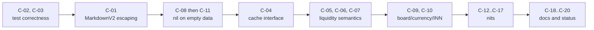

# Handoff: FEAT-01 Market Data & Liquidity — Review Findings

| | |
|---|---|
| **Date** | 2026-10-06 |
| **Scope** | Uncommitted working tree on top of `14f76df` (FEAT-01 `TASK-01-01`..`TASK-01-06` + `TASK-02-02`) |
| **Status** | ⛔ **Not ready to merge** — 3 blocking issues, 8 should-fix |
| **Spec** | [FEAT-01-market-data-liquidity.md](../../docs/features/FEAT-01-market-data-liquidity.md) |

---

## 1. What the change set does

Adds a live trading block to `/bond <ISIN>`:

- New domain model [`MarketData`](../../internal/domain/market_data.go#L19-L37) + liquidity scoring [`CalculateLiquidity`](../../internal/domain/market_data.go#L40-L51).
- `BondProvider.GetMarketData` added to the interface; implemented in MOEX ([client.go](../../internal/provider/moex/client.go#L363)), SPBE (stub, returns `nil, nil`), and composite (MOEX → SPBE).
- MOEX client also extracts issuer INN and primary board (`Bond.IssuerINN`, `Bond.PrimaryBoard`).
- In-memory [`MarketDataCache`](../../internal/store/memory/market_cache.go) with adaptive TTL (120 s in MSK trading hours, 60 min otherwise).
- `BondService.GetBondDetails` replaces `GetBondWithPayments` (kept as a wrapper) and returns bond + market data + payments.
- [`FormatBondPassport`](../../internal/telegram/formatters.go#L12) renders the «📈 Торги и ликвидность» block and the issuer INN.
- Tests: domain/cache/formatter/MOEX unit tests, new BDD feature [bond_market_data.feature](../../features/bond_market_data.feature), live probe [live_probe_test.go](../../tests/integration/live_probe_test.go) (build tag `integration`).
- Docs: checkboxes in `FEATURES_DECOMPOSITION.md` and MVP-1 marked done in `MVP_STAGES.md`.

### File inventory

| Status | File |
|---|---|
| M | `internal/domain/bond.go`, `internal/provider/{provider.go, composite/composite.go, moex/client.go, spbe/client.go}` |
| M | `internal/service/bond_service.go`, `internal/telegram/{bot.go, formatters.go}` |
| M | `tests/bdd/{bdd_test.go, on_demand_steps.go, test_context.go}`, `docs/{FEATURES_DECOMPOSITION.md, MVP_STAGES.md}` |
| A | `internal/domain/market_data{,_test}.go`, `internal/store/memory/market_cache{,_test}.go` |
| A | `internal/provider/moex/client_test.go`, `internal/telegram/formatters_test.go` |
| A | `features/bond_market_data.feature`, `tests/bdd/market_data_steps.go`, `tests/integration/live_probe_test.go` |

## 2. Verification performed

| Check | Result |
|---|---|
| `go build ./...` | ✅ |
| `go test -count=1 ./...` (incl. `./tests/bdd`) | ✅ all pass |
| `go vet ./...` | ⚠️ 1 pre-existing warning (`tests/bdd/subscription_steps.go:19` self-assignment) — not from this diff |
| `go test -tags integration ./tests/integration` (live MOEX ISS) | ✅ pass — real price/YTM/INN returned for `SU26238RMFS4` and `RU000A107456` |

Live output excerpt (used as evidence below):

```text
📈 *Торги и ликвидность:*
• Цена: *50.62%* (506.19 ₽) • НКД: *24.51 ₽*
• Доходность (YTM): *16.51%* • Дюрация: *2464 дн. (~6.7 лет)*
• Оборот сегодня: *348.9 млн ₽* (8020 сделок)
• Ликвидность: 🔥 *Высокая* (спред: *0.01%*)
```

---

## 3. Concerns

Severity legend: 🔴 blocking · 🟠 should fix before MVP-1 sign-off · 🟡 nit / follow-up · 📄 documentation

### 🔴 C-01 — MarkdownV2 is broken; users see raw markup

- **Location:** [formatters.go#L58-L113](../../internal/telegram/formatters.go#L58-L113); fallback in [bot.go#L96-L106](../../internal/telegram/bot.go#L96-L106)
- **Problem:** `SendMessage` uses `parse_mode: MarkdownV2`, where `. ( ) - !` etc. are reserved and must be escaped. The new block emits them unescaped in every line (`98.40%`, `(506.19 ₽)`, `(цена закр.)`, `(спред: …)`, `тыс.`, `дн.`, `(YTM)`). Telegram responds 400, and the bot silently resends as plain text — so the user sees literal `*`, `` ` ``, `\-`.
- **Note:** The pre-existing passport lines (dates `15.05.2041`, `(`) already had this bug, but now *every* `/bond` response triggers it.
- **Impact:** The main deliverable of MVP-1 renders badly in production. The fallback also doubles Telegram API calls.
- **Fix:** Escape all dynamic text *and* static punctuation outside of `*…*` / `` `…` `` markers. E.g. introduce `md2(s string) string` (= current `escapeMarkdown`) and wrap every `fmt.Sprintf` fragment that's not a formatting marker; inside code spans only `` ` `` and `\` need escaping. Optionally log the Telegram error body in the fallback branch.
- **Acceptance:** A unit test that strips valid markers and asserts no unescaped reserved chars remain in `FormatBondPassport` output; manual check in a real chat shows bold/code formatting.

### 🔴 C-02 — `assert.Contains(nil, …)` panics on failure

- **Location:** [market_data_steps.go#L159](../../tests/bdd/market_data_steps.go#L159)
- **Problem:** testify calls `t.Errorf` on a nil `TestingT` when the assertion fails → nil-pointer panic aborts the whole Godog run instead of reporting a failed step.
- **Fix:** Delete the line (the `strings.Contains` check below already covers it) and the `assert` import.
- **Acceptance:** Temporarily break the expected price → the step fails with a readable message, no panic.

### 🔴 C-03 — "Present in the cache" BDD step is a tautology

- **Location:** [market_data_steps.go#L127-L133](../../tests/bdd/market_data_steps.go#L127-L133)
- **Problem:** It calls `bondService.GetMarketData`, which falls through to the provider on cache miss. The step passes even if caching is completely removed.
- **Fix:** Assert against the cache itself — e.g. keep a reference to an injected cache in `TestContext` (see C-04) and call `cache.Get(isin)`.
- **Acceptance:** Setting the cache to `nil` in `BondService` makes this step fail.

### 🟠 C-04 — Service layer depends on a concrete cache implementation

- **Location:** [bond_service.go#L11](../../internal/service/bond_service.go#L11), `NewBondService`, `SetMarketCache`
- **Problem:** `service` imports `store/memory` and hard-wires `*memory.MarketDataCache`. This breaks the existing `store.Store` abstraction and blocks a Firestore/shared cache later (Cloud Run instances don't share memory).
- **Fix:** Define `type MarketDataCache interface { Get(key string) (*domain.MarketData, bool); Set(key string, md *domain.MarketData) }` in `internal/store` (or `service`); inject via constructor/option; wire the memory impl in `cmd/bot/main.go`.
- **Acceptance:** `internal/service` no longer imports `internal/store/memory`.

### 🟠 C-05 — Liquidity shows «Неликвид» for liquid bonds outside the session

- **Location:** [market_data.go#L40-L51](../../internal/domain/market_data.go#L40-L51); scenario «Fallback to previous close price…» in [bond_market_data.feature#L27-L40](../../features/bond_market_data.feature#L27-L40)
- **Problem:** Scoring uses `VALTODAY`/`NUMTRADES`, which are 0 before the open, on weekends and holidays. OFZ 26238 (8 000+ trades/day) will show 🛑 *Неликвид* on Saturday. The BDD scenario currently locks in this behaviour.
- **Impact:** Misleading investment signal — exactly what the bot is supposed to prevent.
- **Fix (pick one):** (a) when `IsPreviousClose` / zero trades, display «нет сделок сегодня» instead of a rating; (b) fetch the previous trading day's volume/trades from ISS `history` and score on that (cache 60 min+). Update the scenario accordingly.
- **Acceptance:** A liquid bond queried off-hours is never labelled «Неликвид» purely because today's volume is 0.

### 🟠 C-06 — Missing bid/offer is treated as a tight spread

- **Location:** [market_data.go#L44](../../internal/domain/market_data.go#L44), [client.go#L507-L510](../../internal/provider/moex/client.go#L507-L510)
- **Problem:** With no two-sided quote, `SpreadPct` stays `0`, which satisfies `< 0.5` / `<= 1.5`. An empty order book can therefore be scored High/Medium.
- **Fix:** Track `HasQuote` (bid > 0 && offer > 0) or use a sentinel; without a quote cap the rating at Low and render «спред: н/д».
- **Acceptance:** Unit test — volume/trades high but bid = offer = 0 → not High.

### 🟠 C-07 — Spread unit is mislabelled

- **Location:** [client.go#L489-L510](../../internal/provider/moex/client.go#L489-L510), formatter line «спред: *x%*»
- **Problem:** MOEX `SPREAD` and `OFFER − BID` are in **percentage points of nominal**, not relative %. For OFZ priced ~50%, 0.01 p.p. ≈ 0.02% relative. Liquidity thresholds (0.5 / 1.5) are therefore also unit-ambiguous.
- **Fix:** Compute relative spread `(offer − bid) / ((offer + bid)/2) × 100` and use it for both display and scoring, or relabel as «п.п.» and re-tune thresholds. Document the choice in the FEAT-01 spec.
- **Acceptance:** Field name/comment, formatter label and thresholds all refer to the same unit.

### 🟠 C-08 — Empty ISS response is treated as valid market data

- **Location:** [`parseMarketDataResponse`](../../internal/provider/moex/client.go#L400), [composite.go `GetMarketData`](../../internal/provider/composite/composite.go#L115-L129)
- **Problem:** ISS returns HTTP 200 with empty tables for unknown securities. The parser still returns a non-nil all-zero `MarketData`, so composite never falls back to SPBE, and the service's ISIN fallback can render «Цена: 0.00% (0.00 ₽) … Неликвид». The 404-based board fallback in `GetMarketData` almost never triggers.
- **Fix:** Return `nil, nil` when both `securities.data` and `marketdata.data` are empty (or when no price, prev close, or YTM is present).
- **Acceptance:** Unit test with `{"securities":{"columns":[…],"data":[]},"marketdata":{…,"data":[]}}` → `nil`.

### 🟠 C-09 — Board / row selection and currency assumptions

- **Location:** [client.go#L423](../../internal/provider/moex/client.go#L423) (securities `Data[0]`), [client.go#L449-L462](../../internal/provider/moex/client.go#L449-L462) (marketdata board pick), [client.go#L514](../../internal/provider/moex/client.go#L514) (RUB price)
- **Problems:**
  1. The `securities` row (`FACEVALUE`, `ACCRUEDINT`, `PREVLEGALCLOSEPRICE`) is always row 0 and is not matched to the board chosen from `marketdata`.
  2. `Bond.PrimaryBoard` is computed in `GetBond` but never used by `GetMarketData`; only `TQCB`/`TQOB` are preferred. Bonds on `TQIR`, `TQOD`, `TQOE`, etc. fall back to "first row", which may be a non-trading board.
  3. `LastPriceRub` and the «₽» labels assume a RUB nominal. For currency bonds (`FACEUNIT` = USD/CNY/EUR) the price is wrong in kind.
- **Fix:** Pass the preferred board into `GetMarketData` (or reuse `PrimaryBoard`); select both the securities and marketdata rows by `BOARDID`; read `FACEUNIT`/`CURRENCYID` and render the proper currency, or convert explicitly.
- **Acceptance:** Unit tests with multi-board payloads (e.g. `TQIR` primary, a CNY bond) produce the correct row and currency.

### 🟠 C-10 — INN enrichment: extra uncached call, and may pick the wrong security

- **Location:** call site [client.go#L194](../../internal/provider/moex/client.go#L194), [`enrichIssuerMetadata`](../../internal/provider/moex/client.go#L529-L576) (row pick at [L565](../../internal/provider/moex/client.go#L565))
- **Problems:**
  1. The `description` block appears not to carry the INN (`EMITENT_INN`/`INN` cases likely never match — to be confirmed), so `/securities.json?q=` fires on nearly every `/bond`: an extra ISS round-trip per request, uncached.
  2. It takes `Data[0]` of a fuzzy search without checking `secid`/`isin`, so a different security's issuer/INN can be attached. INN later drives FEAT-02 (ГИР БО balance), so a wrong INN propagates to wrong financials.
- **Fix:** Pick the row where `secid` or `isin` equals the target; cache issuer metadata per ISIN with a long TTL (INN is effectively static, 30 days is fine); confirm against a live payload whether the description block ever has the INN and remove the dead cases if not.
- **Acceptance:** Unit test where search returns 2 rows with the target second → correct INN; a repeat `/bond` doesn't re-query search.

### 🟠 C-11 — Valid quotes dropped by the service filter

- **Location:** [bond_service.go#L62](../../internal/service/bond_service.go#L62)
- **Problem:** The primary lookup requires `LastPricePct > 0 || TradesCount > 0`. When `lookupKey == bond.ISIN` (most corporate bonds) there's no fallback, so a response with YTM/duration/НКД but no price or trades (new placement, pre-open without prev close) is discarded entirely. The ISIN fallback branch has no such filter → inconsistent behaviour.
- **Fix:** Once C-08 makes the provider return `nil` for "no data", drop the price/trades filter and accept any non-nil result.
- **Acceptance:** A bond with only YTM/НКД still renders the block (price line shows «н/д»).

### 🟡 C-12 — Off-hours TTL overlaps the evening session

- **Location:** [market_cache.go#L64-L83](../../internal/store/memory/market_cache.go#L64-L83)
- **Problem:** "Trading hours" are 09:50–18:50 MSK. MOEX runs an evening session (~19:05–23:50) for many bonds, including OFZ — please confirm the current schedule. During it, quotes are cached for 60 min. Holidays are also not handled (minor, it only means a shorter TTL).
- **Fix:** Extend the window or make it configurable; document the deviation from the AGENTS.md "2 min TTL" rule in the FEAT-01 spec.

### 🟡 C-13 — Cache hands out shared pointers

- **Location:** [market_cache.go#L31-L45](../../internal/store/memory/market_cache.go#L31-L45)
- **Problem:** `Get` returns the stored `*MarketData`; any caller mutating it corrupts the cache for all users. Expired entries are never evicted (unbounded growth with many ISINs, though small in practice).
- **Fix:** Store/return values (copy), and evict lazily on `Get` when expired.

### 🟡 C-14 — Russian pluralisation of fractional years

- **Location:** [market_data.go#L61-L62](../../internal/domain/market_data.go#L61-L62)
- **Problem:** `~6.7 лет` → correct form for a fractional number is `~6,7 года` (Russian decimal comma). Update the tests accordingly.

### 🟡 C-15 — Legacy build constraint

- **Location:** [live_probe_test.go#L2](../../tests/integration/live_probe_test.go#L2)
- **Problem:** `// +build integration` is redundant on Go ≥ 1.17; keep only `//go:build integration`. Also consider wiring this test into `scripts/sanity_check.{ps1,sh}`.

### 🟡 C-16 — Pre-existing: `go vet` self-assignment

- **Location:** `tests/bdd/subscription_steps.go:19` (not part of this diff)
- **Problem:** `tc.memStore = tc.memStore`. Trivial cleanup; keeps `go vet` green for CI.

### 🟡 C-17 — Pre-existing: «Купон 0.00 RUB» for undetermined coupons

- **Location:** payments block in [formatters.go#L131-L136](../../internal/telegram/formatters.go#L131-L136)
- **Evidence:** Live output for `RU000A107456`: «`21.10.2026`: Купон *0.00 RUB*» (floating coupon not yet fixed).
- **Fix:** Render «размер уточняется» when `Amount == 0`.

### 📄 C-18 — FEAT-01 spec not updated with design decisions

- **Location:** [FEAT-01-market-data-liquidity.md](../../docs/features/FEAT-01-market-data-liquidity.md)
- **Problem:** AGENTS.md requires non-obvious decisions to be documented. Missing: adaptive TTL (120 s / 60 min), ticker-first lookup with ISIN fallback, board heuristic (`is_primary` → `SU`/«ОФЗ» → `TQCB`), the extra `/securities.json?q=` INN call, prev-close fallback semantics, spread unit, liquidity thresholds.

### 📄 C-19 — MVP-1 marked «✅ ЗАВЕРШЕНО» prematurely

- **Location:** [MVP_STAGES.md](../../docs/MVP_STAGES.md) (MVP-1 row and section header), [FEATURES_DECOMPOSITION.md](../../docs/FEATURES_DECOMPOSITION.md) (`TASK-01-03`, `TASK-01-05`, `TASK-02-02`)
- **Problem:** Given C-01 (rendering), C-05/C-06/C-07 (liquidity scoring) and C-10 (INN correctness), the status overstates readiness.
- **Fix:** Revert to «🟡 В работе» until the 🔴 and 🟠 items are closed.

### 📄 C-20 — Public API rename not reflected anywhere

- **Problem:** `GetBondWithPayments` is now a compatibility wrapper around `GetBondDetails`, and the `BondProvider` interface gained a method (breaking for any external implementations/mocks). Mention in the spec/changelog. Consider removing the wrapper if nothing else uses it (only `cmd/bot` and tests did).

---

## 4. Recommended fix order



1. **Quick wins (≈1 h):** C-02, C-03, C-08, C-11, C-15, C-16.
2. **User-visible correctness (≈half day):** C-01, C-05, C-06, C-07, C-17.
3. **Structural (≈half day):** C-04, C-09, C-10, C-13.
4. **Docs:** C-18, C-19, C-20 — together with the code, per the AGENTS.md living-docs rule.

## 5. Definition of done

- [ ] All 🔴 and 🟠 items resolved or explicitly deferred with a ticket and a note in the FEAT-01 spec.
- [ ] `go test -count=1 ./tests/bdd` and `go test ./...` pass; `go vet ./...` clean.
- [ ] `go test -tags integration ./tests/integration` passes against live ISS.
- [ ] `scripts/sanity_check.ps1` passes.
- [ ] Manual check in a real Telegram chat: the `/bond SU26238RMFS4` and `/bond RU000A107456` messages render with bold/code formatting, no literal `*` or `\`.
- [ ] Off-hours check (or simulated clock): a liquid OFZ is not labelled «Неликвид».
- [ ] FEAT-01 spec updated; MVP / decomposition status reflects reality.
